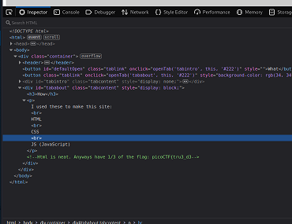
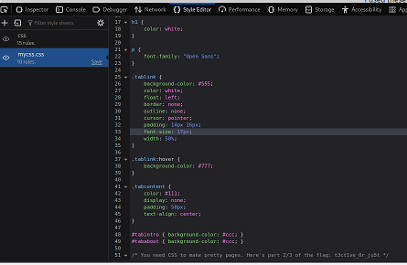
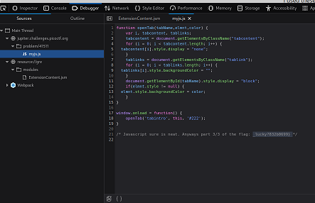

#Insp3ct0r
picoCTF 2019 Web Exploitaion

##Discription
Kishor Balan tipped us off that the following code may need inspection: https://jupiter.challenges.picoctf.org/problem/41511/

##Hints
1-How do you inspect web code on a browser?

2-There's 3 parts

##Walkthrough

1- open the link and click ctrl+shift+i to inspect the page

2-the inspector "HTML part" contains the 1st part of the flag

3- the style editor "CSS part" contains the 2nd part of the flag in the mycss.css file

4-the debugger "JS part" contains the 3rd and final part of the flag in the https://jupiter.challenges.picoctf.org/problem/41511/myjs.js

flag => **picoCTF{tru3_d3t3ct1ve_0r_ju5t_lucky?832b0699}**
