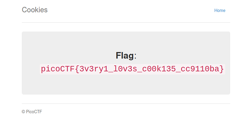

# Cookies
PicoCTF2021 Web Exploitation 
## Discription 
Who doesn't love cookies? Try to figure out the best one. http://mercury.picoctf.net:64944/
## Hints
none

### Walkthrough 
1- open the link to view a simple landing page with simple javascript function

2-you will notice that you're assigned a cookie "name:-1" pair

3- enter snickerdoodle in the search field and you will be redirected to a /check page with new cookie "name:0"

4- change the value of the cookie using cookie-Editor extension  and refresh after saving the cookie till reaching value 18 to get the flag

flag => **picoCTF{3v3ry1_l0v3s_c00k135_cc9110ba}**
